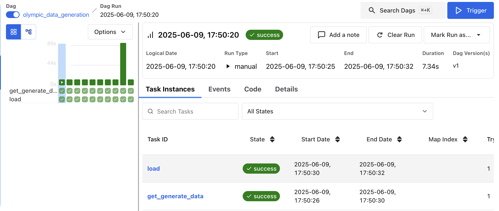
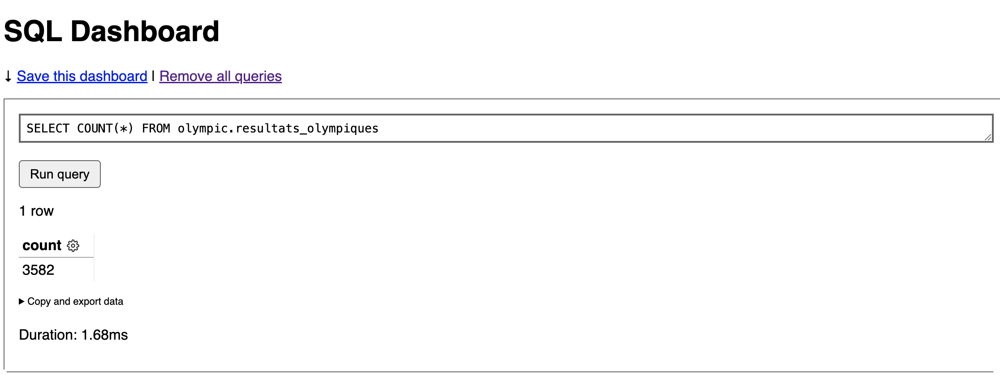

Voici la version **anglaise** du README :

---

# 🏋️ Olympic Data Query Tool

## 🧠 Project Background

This project was built in response to a business need expressed by a Data Analyst: to have a **local tool** to **query sports data** through a **simple SQL interface**, and to **simulate the arrival of new Olympic data** every 4 years using **Apache Airflow**.

---

## 🧱 Technical Architecture

The application is built on the following stack:

* **Docker Compose**: multi-container orchestration
* **PostgreSQL**: relational database for storing Olympic data
* **Django + django-sql-dashboard**: web interface for running SQL queries
* **Apache Airflow**: simulates new Olympic data arrivals every 4 years

```
+------------+       +------------------+       +---------------+
|  Streamlit | <---> | PostgreSQL (DB)  | <-->  | Airflow DAGs  |
|  or Django |       | resultats_olympiques |   | Simulation    |
+------------+       +------------------+       +---------------+
        ^
        |
    SQL Interface via Django
```

---

## 🚀 Project Launch

### ✅ Prerequisites

* Docker + Docker Compose
* Git

### ▶️ Start the Application

```bash
git clone https://github.com/yanggautier/Olympic_Data_Query_Tool.git
cd Olympic_Data_Query_Tool
cp .env.example .env  # Make sure to fill in the required variables
docker-compose up --build
```

The following services will be available:

* **Airflow**: [http://localhost:8080](http://localhost:8080) (`airflow / airflow`)
* **Django SQL Interface**: [http://localhost:8000/admin/sql\_dashboard/](http://localhost:8000/admin/sql_dashboard/)

---

## 🗂 Service Contents

### 📁 `airflow/`

* `dags/sport_simulation_dag.py`: DAG that simulates the addition of new data every 4 years (every 2 minutes in test mode).
* `utils/simulation_data.py`: Generates fake sports data as a DataFrame.
* `requirements.txt`: Airflow-specific dependencies.

### 📁 `django_app/`

* SQL interface via `django_sql_dashboard` (accessible in Django admin).
* Database configured to connect to the `olympic.resultats_olympiques` table in PostgreSQL.

---

## 🔄 Data Simulation

The **`olympic_data_generation`** Airflow DAG runs at regular intervals (every 2 minutes in the test environment). It:

1. Generates fake Olympic results
2. Inserts them into the `olympic.resultats_olympiques` table in PostgreSQL

---

## 📌 SQL Interface

The SQL interface allows read-only queries on Olympic results.

* Accessible at: [http://localhost:8000/admin/sql\_dashboard/](http://localhost:8000/admin/sql_dashboard/)
* Framework used: `django_sql_dashboard`

---

## 📁 Project Structure

```
.
├── docker-compose.yml
├── airflow/
│   ├── dags/
│   │   ├── sport_simulation_dag.py
│   │   └── utils/simulation_data.py
│   └── Dockerfile
├── django_app/
│   ├── django_app/
│   │   ├── settings.py, urls.py, ...
│   │   └── templates/admin/base_site.html
│   ├── requirements.txt
│   └── Dockerfile
├── postgres/
│   └── initdb.sql
└── README.md
```

---

## ⚙️ Technologies Used

| Technology             | Purpose                          |
|------------------------| -------------------------------- |
| Docker Compose         | Multi-container orchestration    |
| PostgreSQL             | Relational data storage          |
| Airflow                | Workflow orchestration (DAGs)    |
| Django                 | Web application & SQL interface  |
| django\_sql\_dashboard | Secure SQL query interface       |
| SQLAlchemy  & psycopg2         | Python ↔ PostgreSQL connectivity |
| pandas                 | Data processing in Python        |

---

## ✅ Fulfilled Criteria

| Criterion                                  | Status                |
| ------------------------------------------ | --------------------- |
| One-command startup using Docker           | ✅ `docker-compose up` |
| Functional SQL interface                   | ✅ via Django admin    |
| Airflow simulates data arrival             | ✅ DAG active          |
| Clean, structured, maintainable codebase   | ✅ modular structure   |
| Technical choices explained in this README | ✅ see above           |

---

## PostgreSQL

The `olympic.resultats_olympiques` table is created using the `initdb.sql` script.

The `analyst` role is read-only and is used exclusively by the Django SQL Dashboard.

---

## Airflow

Trigger the DAG to simulate new Olympic data.



---

## Django\_SQL\_Dashboard

To access the dashboard page, go to `localhost:8000` and log in using the username and password you set in the `.env` file.

Then you'll see a button:


Click it to start querying!
Don’t forget to include the schema name in your queries.



---

## 📚 About

This project was created as part of a Data Engineering learning exercise.

* Author: Guole YANG
* Date: June 2025

---
